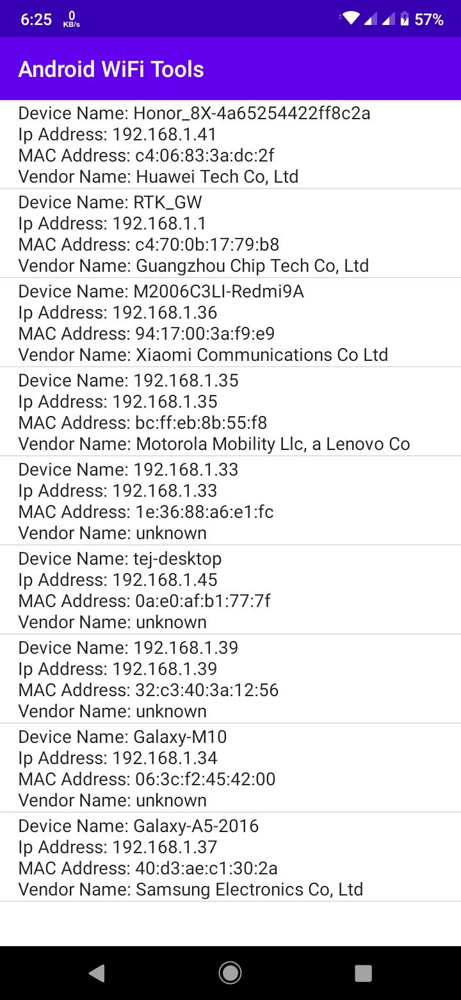

# Android WiFi Tools
Android library for finding connected devices on same WiFi network. It can provide IP Address, device name, MAC Address and vendor names.



## Usuage
Add the JitPack repository to your build file
Add it in your root build.gradle at the end of repositories:

```
allprojects {
	repositories {
		...
		maven { url 'https://jitpack.io' }
	}
}
```

### Add the dependency

```
dependencies {
    implementation 'com.github.tejmagar:AndroidWiFiTools:1.0.0'
}
```

### Add Permission

```
<uses-permission android:name="android.permission.INTERNET"/>
```

### Find Connected Devices
```
 DevicesFinder devicesFinder = new DevicesFinder(this, new OnDeviceFindListener() {
            @Override
            public void onStart() {

            }

            @Override
            public void onDeviceFound(DeviceItem deviceItem) {
                
            }

            @Override
            public void onComplete(List<DeviceItem> deviceItems) {

            }

            @Override
            public void onFailed(String message) {

            }
        });
        
devicesFinder.start();
```

### Set Timeout
Increasing timeout value may give you better results.

```
devicesFinder.setTimeout(5000).start();
```

